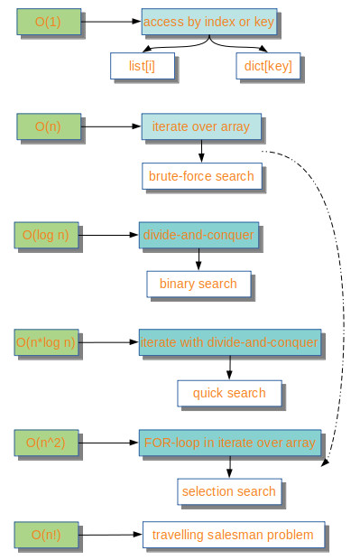

# algorithms_by_python

**About:** Algorithms by Python

**Description:** Different algorithms

- brute_force_search_VC_binary_search.py -- realizations of the brute force search and the binary search and the compare of their speeds

- sort_by_select_VC_quick_sort.py -- realizations of the selection sort and the quick sort and the compare of their speeds

- recursion.py -- simple examples of the recursion 

**Figures**

  

<b>Some cases of BigO</b>

  

<b>Examples of the BigO</b>

